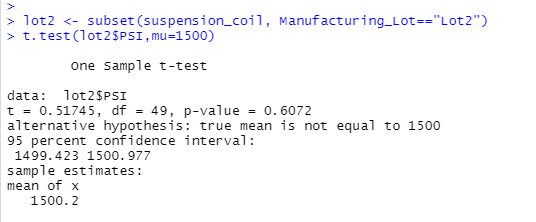
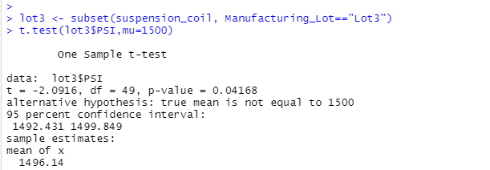

# MechaCar_Statistical_Analysis

%20function%20p-value%20and%20r-sq.png)

Questions to answer: 

1. Which variables/coefficients provided a non-random amount of variance to the mpg values in the dataset?

Vehicle_weight, spoiler_angle , AWD provided a non-random amount of variance

2. Is the slope of the linear model considered to be zero? Why or why not?
No it is not considered to be zero as p-value is 5.35

3. Does this linear model predict mpg of MechaCar prototypes effectively? Why or why not?
R-squared is 71.49% and it means independent variables explains 71.49% of the changes in dependent variable  and hence it predict effectively. 

## Summary Statistics on Suspension Coils

.png)

T-test shows that mean is 1498.7 and is different from mean population 
P-value is higher than 5% hence we cannot reject the null hypothesis

Above three images and lot summary shows that mean for all from all three tests is above population mean
Also, p-value is higher than 5% for all three tests and lack of sufficient data to reject null hypothesis

## Study Design: MechaCar vs Competition

Questions:

1. What metric or metrics are you going to test?
We are going to test these metrics: Cost of vehicle, highway fuel efficiency and maintenance cost.

2. What is the null hypothesis or alternative hypothesis?
Null hypothesis: 
There is No statistically significant relationship between dependent (MechaCar cost) and independent variables (highway fuel efficiency and maintenance down the road.)

Alternate hypothesis: 
There is  statistically significant relationship between dependent (MechaCar cost) and independent variables (highway fuel efficiency and maintenance down the road.)

3. What statistical test would you use to test the hypothesis? And why?
Multiple linear regression statistical test as this allows us to have multiple independent variables

4. What data is needed to run the statistical test?
Data is needed for following variables: Cost of vehicle, highway fuel efficiency and maintenance cost.
